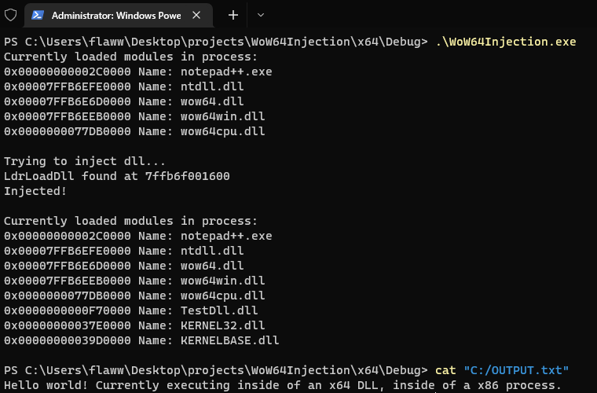
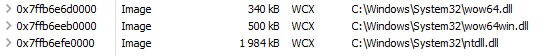
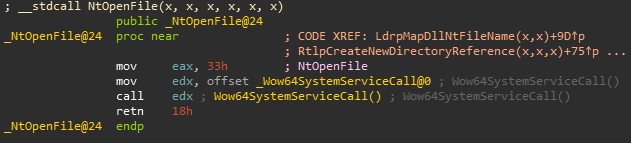
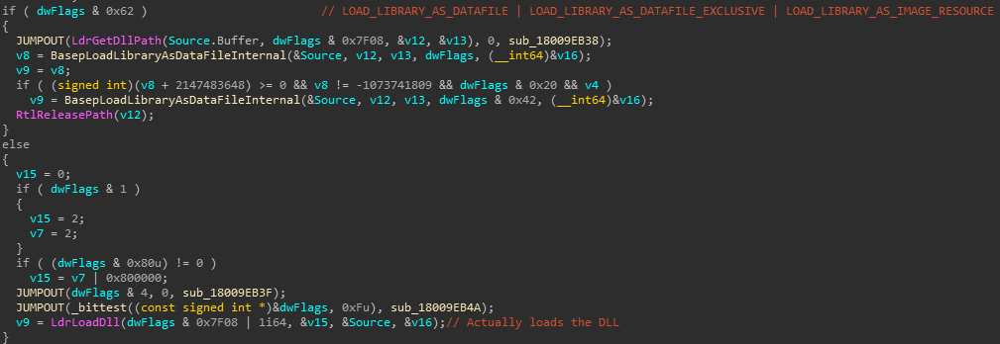

# Loading a 64-bit DLL in a 32-bit process
This is a proof of concept illustrating how a 64-bit DLL can be loaded into a 32-bit process.

In the following example run, my 64-bit DLL, `TestDll.dll`, is injected into `notepad++.exe`, which is a x86 application. This DLL simply creates and writes to the file `C:/OUTPUT.txt`, the code for this can be found in this repo under `TestDll/TestDll.cpp`.


## Why would this be useful?
Executing code in 64-bit memory can be a lot more sneaky than staying in the normal 32-bit address space. For one, if the image is mapped outside of the range of the 32-bit addresses, this memory is in effect "invisible" for the x86 application itself (even though other x64 applications would still be able to access it). This can allow you to hide the fact that you even have code injected into the process.

Furthermore, all syscalls made in an x86 application go through the x64 version of `ntdll.dll` that it has loaded. If you reside in 64-bit memory yourself, you can easily hook these syscalls, in memory that is inaccessible to x86 application, which makes these hooks both very sneaky and hard to circumvent. This is very powerful.

## How it works
When looking at the allocated memory of a x86 application in Process Hacker, the following can always be seen:


Weird. DLL's loaded in 64-bit memory in a x86 application? Why would these be here? 

The answer is WoW64. WoW64 is an emulator/compatability layer which allows the 64-bit operating system to properly run x86 applications, more specifically it allows the x86 application to, for example, use syscalls. The Windows NT kernel except the syscalls to be the 64-bit version, hence whenever an x86 application wants to interact with the kernel, all the arguments for the syscall needs to be translated to the x64-counterpart. 

### Heaven's Gate
Looking at a syscall in the x86 version of `ntdll.dll`:


As can be seen here, no normal SYSENTER/interrupt is done here, instead it calls the function `Wow64SystemServiceCall`. Following the execution here with a debugger, it leads to to a special `far jmp` instruction, which also is the instruction that performs the segment switch to x64-mode. This is usually referred to as "Heaven's gate". 

Ok, so this is how we will be able to enter x64-mode. What now?

### Loading the DLL
Now that we know how to switch execution to 64-bit, we need to figure out a way to get our DLL loaded. As seen from the Process Hacker screenshot above, the only relevant library that we have access to is `ntdll.dll`. At this point, we have 2 different approaches for getting our DLL loaded.

#### Manual map
The first approach is manually mapping it. If the goal is to sneaky, this definitely the recommended approach, for obvious reasons. One caveat with this method is that you'd preferebly also have to manually map all dependencies too. Despite being a bit annoying, it shouldn't be that big of an issue.

#### Windows API
The second approach is using the Windows API to somehow call the `LoadLibrary` function to "organically" load the DLL. For the sake of this proof of concept, this is the method I chose.
Following a call to `LoadLibrary`, we find ourselves in the function `LoadLibraryExW` in `KernelBase.dll`, where the following code can be seen:


This is good. To actually load the DLL, the function `LdrLoadDll`, imported from `ntdll.dll`, is used. Being a function exported from `ntdll.dll`, this is something we have access to while executing in 64-bit mode without having to perform any manual map.

The current plan is to switch the execution to 64-bit, somehow call `LdrLoadDll` to load our DLL, and eventually switch back the execution to x86. For this, I crafted a piece of shellcode which encodes the following instructions:
```assembly
jmp m16:32          ; far jump with segment (switch to x64)
xor rcx, rcx        ; zero first param
xor rdx, rdx        ; zero second param 
mov r8, imm64       ; address of UNICODE_STRING
mov r9, imm64       ; address of OUT HANDLE
mov rax, imm64      ; address of LdrLoadDll 
call rax            ; calls LdrLoadDll      
jmp fword ptr[rip]  ; far jump with segment (switch back to x86)                                        
ret
```
This is all that is needed! Now we just map this shellcode and write the addresses into it, and then get this shellcode to execute in the target application. Refer to the `MapperLoadX64ModuleInX86Target` function in `mapper.c` to see how this is all actually implemented.

## Example 
Basic example how to interact with the mapper. Additional usage is shown in `test.cpp`
```c++
uint32_t pid = MapperGetPid((PCHAR)"procname.exe")
HANDLE h = OpenProcess(PROCESS_ALL_ACCESS, FALSE, pid);

MapperLoadX64ModuleInX86Target(h, (PCHAR)"TestDll.dll");
```

## Notes on compilation
Directory `phnt` needs to be added as an additional include directory. The 64-bit DLL should preferebly have static linking enable, to reduce the amount of dependencies as these can cause problems at times.